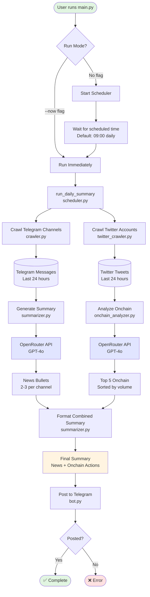
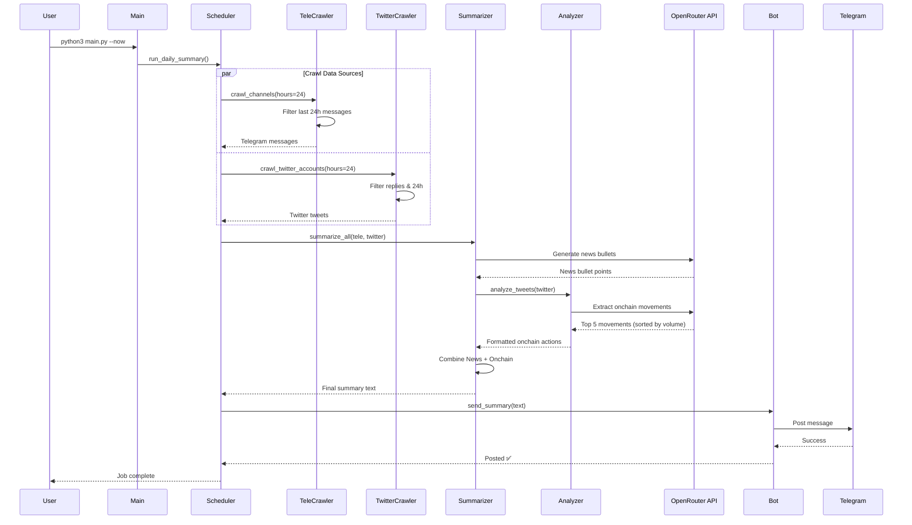

# Telegram & Twitter News Bot - Architecture Diagram

## System Flow



## Component Details

```mermaid
flowchart LR
    subgraph Config["Configuration (config.py)"]
        TeleChannels[tele_channels.txt]
        TwitterAccounts[twitter_channels.txt]
        EnvVars[.env file]
    end
    
    subgraph Crawlers["Data Collection"]
        TeleCrawler[Telegram Crawler<br/>Uses Telethon API]
        TwitterCrawler[Twitter Crawler<br/>Uses TwitterAPI.io]
    end
    
    subgraph Processing["AI Processing"]
        NewsSummarizer[News Summarizer<br/>Extracts key points]
        OnchainAnalyzer[Onchain Analyzer<br/>Extracts movements<br/>+ volumes + links]
    end
    
    subgraph Output["Output"]
        Formatter[Format Summary<br/>News + Onchain sections]
        TeleBot[Telegram Bot<br/>Posts to channel]
    end
    
    Config --> Crawlers
    Crawlers --> Processing
    Processing --> Output
    
    style Config fill:#f0f0f0
    style Crawlers fill:#e1f5e1
    style Processing fill:#e1e5ff
    style Output fill:#fff4e1
```



## Data Flow Detail



## File Structure

```
telegram-news-bot/
├── main.py                 # Entry point
├── scheduler.py            # Orchestrates daily workflow
├── crawler.py              # Telegram channel crawler
├── twitter_crawler.py      # Twitter account crawler
├── summarizer.py           # AI news summarization
├── onchain_analyzer.py     # AI onchain analysis
├── bot.py                  # Telegram bot posting
├── config.py               # Configuration loader
├── tele_channels.txt       # Telegram channels list
├── twitter_channels.txt    # Twitter accounts list
├── requirements.txt        # Dependencies
└── .env                    # API keys & settings
```

## Key Features

### 1. **Dual Source Crawling**
- **Telegram**: Crawls messages from channels using Telethon
- **Twitter**: Crawls tweets from accounts using TwitterAPI.io
- Both filter to last 24 hours only

### 2. **AI-Powered Analysis**
- **News Summarization**: GPT-4o extracts 2-3 key bullet points per channel
- **Onchain Analysis**: GPT-4o identifies top 5 movements by USD volume
- Includes blockchain explorer links (t.co shortened URLs)

### 3. **Smart Filtering**
- Telegram: All messages from channels
- Twitter: Excludes replies, only original tweets
- Time-based: Strict 24-hour window (UTC)

### 4. **Output Format**
```
Summary DD-MM-YYYY

News:
- Bullet point 1
- Bullet point 2
- Bullet point 3

Onchain Actions:
- Movement 1 ([link](url))
- Movement 2 ([link](url))
- Movement 3 ([link](url))
- Movement 4 ([link](url))
- Movement 5 ([link](url))
```

### 5. **Scheduling**
- Default: Runs daily at 09:00
- Manual: `python3 main.py --now`
- Configurable via `.env` file
